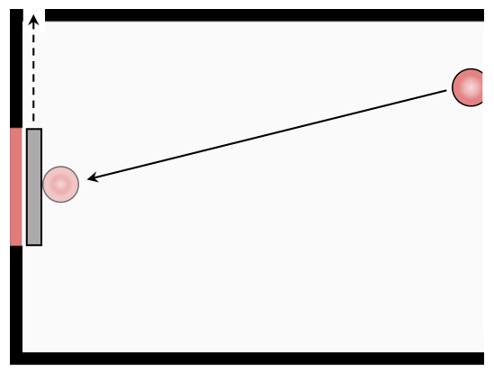

# Load packages

```{r, warning=F, message=F}
library("Hmisc")      # bootstrapped means 
library("rjson")      # read in json 
library("janitor")    # clean up column names
library("ggtext")     # for adding figures to ggplot 
library("knitr")      # for knitting stuff
library("kableExtra") # for markdown tables
library("xtable")     # for latex tables
library("brms")       # for Bayesian regression models 
library("ggeffects")  # for computing marginal effects
library("png")        # add pngs to ggplots
library("grid")       # add images to ggplots
library("car")        # for ANOVAs
library("broom")      # for tidy model results
library("papaja")     # for extracting model results
library("afex")       # for ANOVAs 
library("emmeans")    # estimated marginal means
library("tidyjson")   # for reading in json files
library("lsr")        # for calculating effect sizes
library("DT")         # for nice html tables
library("tidyverse")  # everything else
```

```{r}
theme_set(theme_classic() +
            theme(text = element_text(size = 24)))

opts_chunk$set(comment = "",
               fig.show = "hold")

options(dplyr.summarise.inform = F) # disable summarize ungroup messages
```

# Functions 

```{r}
# function for printing out html or latex tables 
print_table = function(data, format = "html", digits = 2){
  if(format == "html"){
    data %>% 
      kable(digits = digits) %>% 
      kable_styling()
  }else if(format == "latex"){
    data %>% 
      xtable(digits = digits,
             caption = "Caption",
             label = "tab:table") %>%
      print(include.rownames = F,
            booktabs = T,
            sanitize.colnames.function = identity,
            caption.placement = "top")
  }
}
```

# Experiment 1

## Read in data

```{r}
df.exp1.long = read.delim(file = "../../data/empirical/experiment1_data.txt",
                          header = TRUE,
                          sep = "\t",
                          na.strings = "NA",
                          dec = ".",
                          strip.white = TRUE,
                          stringsAsFactors = F) %>% 
  clean_names() %>% 
  rename(participant = id,
         question = query) %>% 
  mutate(condition = case_when(expectation %in% c("cause", "prevent") ~ "experience",
                               expectation %in% c("help", "hinder") ~ "social",
                               expectation %in% c("none_wt", "none_m") ~ "none"),
         condition = factor(condition, levels = c("none", "experience", "social")),
         question = factor(question, levels = c("causation", "probability")),
         expectation = ifelse(expectation %in% c("none_wt", "none_m"), "none", expectation),
         target = ifelse(target == "missed", "miss", "hit"),
         target = factor(target, levels = c("hit", "miss")),
         sex = ifelse(sex == 1, "female", "male"),
         participant = 1:n()) %>% 
  select(participant, question, condition, expectation, target, everything(), -number)
```

## Demographics

```{r}
df.exp1.long %>% 
  summarize(age_mean = mean(age),
            age_sd = sd(age),
            n = n(), 
            n_causation = sum(question == "causation"),
            n_probability = sum(question == "probability"),
            n_female = sum(sex == "female")) %>% 
  print_table(digits = 0)
```
## Read in model predictions 

```{r}
df.exp1.model = read.table("../../data/simulations/experiment1_simulations.dat") %>%
  rename(noise = V1,
         hinderer = V2,
         helper = V3) %>%
  mutate_at(.vars = vars(hinderer, helper),
            .funs = ~ (as.numeric(str_remove(., pattern = "%")) / 100)) %>% 
  rename(hit = hinderer,
         miss = helper) %>% 
  mutate(hit = 1 - hit)
```

## Find best-fitting models 

- Find noise values which minimize sum of squared errors for each condition. 

```{r, warning=F}
df.exp1.bestmodel = df.exp1.model %>% 
  pivot_longer(cols = -noise,
               values_to = "prediction") %>% 
  left_join(df.exp1.long %>% 
              group_by(condition, target) %>% 
              summarize(rating = mean(rating)),
            by = c("name" = "target")) %>% 
  mutate(prediction = prediction * 100,
         squared_error = (prediction - rating)^2) %>% 
  group_by(condition, noise) %>% 
  summarize(sse = sum(squared_error)) %>% 
  group_by(condition) %>% 
  filter(row_number() == which.min(sse))

df.exp1.bestmodel %>% 
  print_table()
```

## Plot

### Judgments

```{r fig.height=6, fig.width=12, warning=F}
set.seed(1)

# data 
df.plot = df.exp1.long %>% 
  mutate(target = factor(target,
                         levels = c("hit", "miss"),
                         labels = c("went\nthrough", "missed")),
         condition = factor(condition,
                            levels = c("none",
                                       "experience",
                                       "social"),
                            labels = c("no expectations",
                                       "statistical expectation",
                                       "social expectation")))
# model predictions 
df.model = df.exp1.model %>% 
  filter(noise %in% df.exp1.bestmodel$noise) %>% 
  left_join(df.exp1.bestmodel %>% 
              select(condition, noise),
            by = "noise") %>% 
  pivot_longer(cols = c(miss, hit),
               names_to = "target",
               values_to = "rating") %>% 
  mutate(target = factor(target,
                         levels = c("hit", "miss"),
                         labels = c("went\nthrough", "missed")),
         condition = factor(condition,
                            levels = c("none",
                                       "experience",
                                       "social"),
                            labels = c("no expectations",
                                       "statistical expectation",
                                       "social expectation")),
         rating = rating * 100)

# text with participant numbers
df.text = df.plot %>% 
  count(question, condition, target) %>% 
  mutate(label = str_c("n = ", n),
         rating = 105)

df.label = tibble(condition = rep("none", 2),
                  x = rep(0.45, 2),
                  y = c(0, 100),
                  label = c("no", "yes")) %>% 
  mutate(condition = factor(condition,
                            levels = c("none",
                                       "experience",
                                       "social"),
                            labels = c("no expectations",
                                       "statistical expectation",
                                       "social expectation")))

ggplot(data = df.plot,
       mapping = aes(x = target,
                     y = rating,
                     group = question,
                     fill = question,
                     color = question)) + 
  geom_hline(yintercept = 50,
             linetype = 2) +
  geom_point(position = position_jitterdodge(dodge.width = 0.75,
                                             jitter.width = 0.1,
                                             jitter.height = 0),
             alpha = 0.2,
             show.legend = F) + 
  geom_point(data = df.model,
             mapping = aes(group = NA,
                           fill = NA,
                           color = NA,
                           shape = "model prediction"),
             size = 4,
             # shape = 21, 
             alpha = 1,
             color = "black",
             fill = "white",
             stroke = 1) + 
  stat_summary(geom = "pointrange",
               fun.data = "mean_cl_boot",
               position = position_dodge(width = 0.75),
               shape = 21,
               size = 1,
               color = "black") +
  geom_text(data = df.text,
            mapping = aes(label = label),
            color = "black",
            position = position_dodge(width = 0.75),
            size = 4) +
  geom_text(data = df.label,
            mapping = aes(x = x,
                          y = y,
                          group = NA,
                          fill = NA,
                          color = NA,
                          label = label),
            color = "black",
            hjust = 0,
            nudge_x = 0.001,
            size = 6) +
  facet_grid(cols = vars(condition)) +
  # labs(y = "Ball B went through / missed the gate\nbecause ball A didn't hit it.",
  labs(y = "Cause / probability judgments",
       shape = "") +
  scale_fill_brewer(palette = "Set1") +
  scale_y_continuous(breaks = seq(0, 100, 25)) + 
  scale_shape_manual(values = c("model prediction" = 21)) + 
  theme(axis.title.x = element_blank(),
        axis.title.y = element_text(size = 20),
        legend.position = "bottom")

ggsave("../../figures/plots/exp1_points.pdf",
       width = 12,
       height = 6)
```

### Model predictions across noise parameter 

```{r fig.height=6, fig.width=8}
df.plot = df.exp1.model %>% 
  pivot_longer(cols = -noise) %>% 
  filter(noise <= 1)

png_hit = readPNG("../../figures/diagrams/experiment1/hit_counterfactual_label.png")
png_hit = rasterGrob(png_hit, interpolate = T)

png_miss = readPNG("../../figures/diagrams/experiment1/miss_counterfactual_label.png")
png_miss = rasterGrob(png_miss, interpolate = T)

ggplot(data = df.plot,
       mapping = aes(x = noise,
                     y = value,
                     color = name,
                     group = name)) +
  geom_line(size = 0.75) + 
  geom_point(size = 2) + 
  annotate(geom = "text",
           x = rep(max(df.plot$noise) + 0.02, 2),
           y = df.plot %>% 
             group_by(name) %>% 
             filter(noise == max(noise)) %>% 
             pull(value),
           label = c("went through", "missed"),
           hjust = 0,
           size = 6) +
  geom_rect(mapping = aes(xmin = 0.55,
                    xmax = 1,
                    ymin = 0.25,
                    ymax = 0.6),
            color = "#377eb8",
            fill = NA,
            size = 3) + 
  geom_rect(mapping = aes(xmin = 0.55,
                    xmax = 1,
                    ymin = 0.75,
                    ymax = 1.1),
            color = "#e41a1c",
            fill = NA,
            size = 3) + 
  annotation_custom(grob = png_miss,
                    xmin = 0.4,
                    xmax = 1.15,
                    ymin = 0.25,
                    ymax = 0.6) + 
  annotation_custom(grob = png_hit,
                    xmin = 0.4,
                    xmax = 1.15,
                    ymin = 0.75,
                    ymax = 1.1) + 
  labs(y = "probability that outcome would have been different",
       x = "noise level") +
  coord_cartesian(clip = "off",
                  ylim = c(0, 1),
                  xlim = c(0, 1)) + 
  scale_y_continuous(breaks = seq(0, 1, 0.25),
                     labels = str_c(seq(0, 100, 25), "%"),
                     expand = expansion(mult = c(0, 0.01))) +
  scale_x_continuous(expand = expansion(add = c(0.05, 0)),
                     breaks = seq(0, 1, 0.2)) +
  scale_color_brewer(palette = "Set1") + 
  theme(axis.title.y = element_text(size = 16),
        legend.title = element_blank(),
        legend.position = "none",
        plot.margin = margin(t = 1.5, l = 0.4, b = 0.1, r = 4, unit = "cm"))

ggsave("../../figures/plots/exp1_model_noise.pdf",
       width = 8,
       height = 6)
```


## Stats 

### ANOVA 

```{r, warning=F}
fit.aov_exp1 = aov_ez(id = "participant",
                      dv = "rating",
                      data = df.exp1.long,
                      between = c("question", "condition", "target"))
```

### Follow-up tests 

#### Effect of outcome

```{r, warning=F}
fit.aov_exp1 %>% 
  emmeans(~ target) %>% 
  pairs() %>% 
  apa_print() %>% 
  pluck("full_result") %>% 
  pluck("hit_miss")
```

#### Effect of condition 

```{r, warning=F}
# comparing no expectations with the other two 
fit.aov_exp1 %>%
  emmeans(~ condition) %>%
  contrast(list(none_vs_rest = c(-1, 0.5, 0.5))) %>% 
  apa_print() %>% 
  pluck("full_result") %>% 
  pluck("none_vs_rest")

# compare all three conditions with each other 
fit.aov_exp1 %>% 
  emmeans(~ condition) %>% 
  pairs() %>% 
  apa_print() %>% 
  pluck("full_result") %>% 
  pluck("experience_social")
```

## Tables 

### ANOVA table 

```{r}
fit.aov_exp1 %>% 
  apa_print() %>% 
  pluck("table") %>% 
  select(-c(df.residual, mse)) %>% 
  print_table()
  # print_table(format = "latex")
```

# Experiment 2

## Read in data

```{r}
df.exp2.long = read.delim(file = "../../data/empirical/experiment2_data.txt",
                          header = TRUE,
                          sep = "\t",
                          na.strings = "NA",
                          dec = ".",
                          strip.white = TRUE) %>% 
  clean_names() %>% 
  mutate(sex = factor(sex,
                      levels = 1:2,
                      labels = c("female", "male"))) %>% 
  select(participant = s_id,
         sex,
         age, 
         clip = target_pattern,
         rating)
```

## Demographics 

```{r}
df.exp2.long %>% 
  summarize(age_mean = mean(age),
            age_sd = sd(age),
            n = n(), 
            n_female = sum(sex == "female")) %>% 
  print_table(digits = 0)
```


## Plots 

### Results figure 

```{r fig.height=6, fig.width=8}
set.seed(1)

n_samples = df.exp2.long %>%
  count(clip) %>%
  pull(n) %>% 
  str_c("n = ", .) 

labels = c(causation = str_c("not blocked<br>(", n_samples[1],")<br>"),
           prevention = str_c("blocked<br>(", n_samples[2],")<br>"))

ggplot(data = df.exp2.long,
       mapping = aes(x = clip,
                     y = rating)) + 
  geom_hline(yintercept = 50,
             linetype = 2) +
  geom_jitter(alpha = 0.2,
              height = 0,
              width = 0.09,
              size = 2) + 
  annotate(geom = "text",
           x = 1:2,
           y = rep(115, 2),
           label = c("The ball went through the gate\nbecause the wall didn't move.",
                     "The ball didn't go through the gate\nbecause the wall didn't move."),
           size = 5) +
  stat_summary(geom = "pointrange",
               fun.data = "mean_cl_boot",
               shape = 21,
               size = 1.5,
               fill = "red") + 
  annotate(geom = "text",
           x = rep(0.42, 2),
           y = c(0, 100),
           label = c("no", "yes"),
           hjust = 0,
           vjust = 0.5,
           size = 6) + 
  # labs(y = "The ball went through the gate\nbecause the wall didn't move.") + 
  coord_cartesian(ylim = c(0, 100),
                  clip = "off") + 
  scale_x_discrete(name = NULL,
                   labels = labels) +
  scale_y_continuous(breaks = seq(0, 100, 25),
                     expand = expansion(add = c(5, 0))) +
  theme(text = element_text(size = 24),
        axis.text.x = element_markdown(),
        axis.title.y = element_blank(),
        plot.margin = margin(t = 1.7, l = 0.2, r = 0.2, unit = "cm"))

ggsave(filename = "../../figures/plots/exp2_points.pdf",
       width = 8,
       height = 6)
```

## Stats 

### Means and standard deviations 

```{r}
df.exp2.long %>% 
  group_by(clip) %>% 
  summarize(mean = mean(rating),
            sd = sd(rating)) %>% 
  print_table()
```


### Linear model / t-test 

```{r}
lm(formula = rating ~ clip, 
         data = df.exp2.long) %>% 
  emmeans("clip") %>% 
  pairs() %>% 
  apa_print() %>% 
  pluck("table") %>% 
  print_table()
```


# Experiment 3

## Read in data and wrangle it

```{r}
df.exp3.wide = read.delim(file = "../../data/empirical/experiment3_data.txt",
                          header = TRUE,
                          sep = "\t",
                          na.strings = "NA",
                          dec = ".",
                          strip.white = TRUE)

df.exp3.long = df.exp3.wide %>%
  clean_names() %>%
  select(s_id:difficulty) %>%
  rename(participant = s_id,
         question_order = q_order,
         color_order = col_order,
         barrier_position = barrier_pos) %>% 
  mutate(participant = 1:n()) %>% 
  pivot_longer(names_to = "question",
               values_to = "rating",
               cols = c(blame, difficulty)) %>%
  mutate(rating = rating + 50,
         rating = ifelse(barrier_position == "bottom", 100 - rating, rating))
```

## Demographics 

```{r}
df.exp3.wide %>% 
  clean_names() %>% 
  summarize(age_mean = mean(age),
            age_sd = sd(age),
            n = n(), 
            n_female = sum(sex == 2)) %>% 
  print_table(digits = 0)
```

## Read in model predictions 

```{r}
df.exp3.model = read.table("../../data/simulations/experiment3_simulations.dat",
                           header = T) %>%
  pivot_longer(cols = -noise,
               names_to = c("clip", "limit"),
               names_sep = "_") %>% 
  mutate(limit = str_remove(limit, pattern = "lim"),
         value = 1 - (as.numeric(str_remove(value, pattern = "%")) / 100)) %>% 
  # only keep simulations that don't have a limit on the number of collisions 
  filter(limit == "inf") %>%
  pivot_wider(names_from = clip,
              values_from = value) %>% 
  rename(obstacle = obs, 
         no_obstacle = non)
```

## Read json files of all the simulated runs 

```{r, warning=F, message=F, eval=F}
outcome_and_number_of_collisions = function(x){
  
  x = x %>% 
    as.tbl_json() %>% 
    spread_values(outcome = jstring(outcome, E)) %>% 
    select(-document.id)
  
  if(x$outcome == T){
    df = x %>% 
      as_tibble() %>% 
      mutate(outcome_time = x %>% 
               enter_object("collisions") %>% 
               gather_array("objects") %>% 
               spread_values(time = jstring(step)) %>% 
               enter_object("objects") %>% 
               gather_array("balls") %>% 
               append_values_string("index") %>% 
               as_tibble() %>% 
               filter(index == "E") %>% 
               # filter out first collision with E
               filter(row_number() == 1) %>%
               mutate(time = as.numeric(time)) %>% 
               pull(time))
    
    if (x %>% enter_object("wall_bounces") %>% nrow() == 0){
      df = df %>%
        mutate(ncollisions = 0)
    }else{
      df = df %>% 
        mutate(ncollisions = x %>% 
                 enter_object("wall_bounces") %>% 
                 gather_array("index") %>% 
                 enter_object("step") %>% 
                 append_values_string("collision_time") %>% 
                 as_tibble() %>% 
                 mutate(collision_time = as.numeric(collision_time)) %>% 
                 # filter out collisions that happened after the collision between the balls
                 filter(is.na(outcome_time) | (collision_time < outcome_time)) %>% 
                 summarize(ncollisions = n()) %>% 
                 pull(ncollisions))
        }
  }else{
    df = x %>% 
      as_tibble() %>% 
      mutate(ncollisions = NA,
             outcome_time = NA)
  }
  return(df)
}

df.simulations = read_delim("../python/all_obstacle.json",
                            delim = "\n",
                            col_names = F) %>% 
  mutate(condition = "obstacle") %>% 
  bind_rows(read_delim("../python/all_non_obstacle.json",
                       delim = "\n",
                       col_names = F) %>% 
              mutate(condition = "no_obstacle")) %>% 
  set_names(c("information", "condition")) %>%
  mutate(summary = map(.x = information,
                       .f = ~ outcome_and_number_of_collisions(.x))) %>% 
  select(-information) %>% 
  unnest(summary) %>% 
  group_by(condition) %>% 
  mutate(index = 1:n()) %>% 
  ungroup() %>% 
  select(index, everything())

save(list = "df.simulations",
     file = "cache/simulations.RData")
```

## Find best-fitting model 

```{r}
beta = 9

softmax = function(beta, theta){
  unlist(exp(beta*theta[,1])/rowSums(exp(beta*theta))) 
}

df.exp3.bestmodel = df.exp3.model %>% 
  mutate(prediction = map2_dbl(.x = no_obstacle,
                               .y = obstacle,
                               .f = ~ softmax(beta = beta, theta = tibble(.x, .y))),
         rating = df.exp3.long %>% 
           mutate(rating = ifelse(question == "blame", 100 - rating, rating)) %>% 
           summarize(rating = mean(rating)) %>% 
           pull(rating)) %>% 
  mutate(prediction = prediction * 100,
         squared_error = (prediction - rating)^2) %>% 
  filter(row_number() == which.min(squared_error))

df.exp3.bestmodel %>% 
  print_table()
```

## Plots

### Difficulty and blame

```{r fig.height=6, fig.width=8}
set.seed(1)

df.plot = df.exp3.long %>% 
  mutate(question = factor(question,
                           levels = c("difficulty", "blame"),
                           label = c(1, 2)),
         question = as.numeric(as.character(question)),
         question_jitter = question + runif(n = n(),
                                            min = -0.15,
                                            max = 0.15))

df.model = df.exp3.bestmodel %>% 
  select(difficulty = prediction) %>% 
  mutate(blame = 100 - difficulty) %>% 
  pivot_longer(cols = everything(),
               names_to = "question",
               values_to = "rating") %>% 
  mutate(question = factor(question,
                           levels = c("difficulty", "blame"),
                           label = c(1, 2)),
         question = as.numeric(as.character(question)))

ggplot(df.plot,
       aes(x = question,
           y = rating)) +
  geom_hline(yintercept = 50,
             linetype = 2) +
  geom_line(mapping = aes(x = question_jitter,
                          group = participant),
             alpha = 0.05,
             color = "black",
             size = 1) +
  geom_point(mapping = aes(x = question_jitter),
             alpha = 0.3,
             color = "black",
             size = 2) +
  stat_summary(fun.data = "mean_cl_boot",
               mapping = aes(shape = "mean judgment"),
               geom = "pointrange",
               fill = "red",
               size = 1.2)  +
  geom_point(data = df.model,
             mapping = aes(shape = "model prediction"),
             fill = "white",
             stroke = 1,
             size = 5) + 
  annotate(geom = "text",
           x = c(0.42, 0.42),
           y = c(0, 100),
           label = c("marble without\nobstacle",
                     "marble with\nobstacle"),
           size = 5,
           hjust = 0) + 
  annotate(geom = "text",
           x = 1.5,
           y = 105,
           label = str_c("n = ", length(unique(df.plot$participant))),
           size = 6) + 
  annotate(geom = "text",
           x = 1,
           y = 120,
           label = "For which player\nis it more difficult?",
           size = 6) + 
  annotate(geom = "text",
           x = 2,
           y = 120,
           label = "Which player is\nmore to blame?",
           size = 6) + 
  scale_y_continuous(expand = expansion(add = c(10, 0)),
                     breaks = seq(0, 100, 25)) + 
  scale_x_continuous(expand = expansion(mult = c(0.01, 0.2)),
                     breaks = 1:2,
                     labels = c("difficulty\nquestion", "blame\nquestion")) +
  scale_shape_manual(values = c("mean judgment" = 21,
                                "model prediction" = 21)) +
  coord_cartesian(ylim = c(0, 100),
                  clip = "off") + 
  theme(legend.position = "bottom",
        axis.title.x = element_blank(),
        legend.title = element_blank(),
        axis.title.y = element_blank(),
        axis.text.x = element_blank(),
        plot.margin = margin(t = 3, unit = "cm")) +
  guides(shape = guide_legend(override.aes = list(fill = c("red", "white"))))

ggsave(filename = "../../figures/plots/exp3_points_lines.png",
# ggsave(filename = "../../figures/plots/exp3_points_lines.pdf",
       width = 8,
       height = 6)
```

### Plot how the number of successes changes as a function of the collisions allowed 

```{r fig.height=4, fig.width=8}
load("cache/simulations.RData")

png = readPNG("../../figures/diagrams/experiment3/exp3_inital_stage.png")
png = rasterGrob(png, interpolate = T)

df.plot = df.simulations %>% 
  filter(outcome == T) %>% 
  count(condition, ncollisions) %>% 
  complete(condition, ncollisions, fill = list(n = 0))

ggplot(data = df.plot,
       mapping = aes(x = ncollisions,
                     y = n,
                     color = condition)) + 
  geom_line() + 
  geom_point(size = 2) +
  annotation_custom(grob = png,
                    xmin = 16,
                    xmax = 31,
                    ymin = 20,
                    ymax = 70) + 
  annotate(geom = "text",
           x = c(31, 31),
           y = c(64, 25),
           label = c("with\nobstacle", "without\nobstacle"),
           size = 4,
           hjust = 0) + 
  scale_color_manual(values = c(rgb(21, 27, 228, maxColorValue = 255),
                                rgb(74, 232, 29, maxColorValue = 255)),
                     labels = c("without obstacle", "with obstacle")) + 
  scale_x_continuous(expand = expansion(add = c(1, 0.5)),
                     breaks = seq(0, 30, 5)) +
  scale_y_continuous(expand = expansion(add = c(1, 1))) +
  labs(x = "number of collisions",
       y = "number of successful shots",
       color = "marble") +
  theme(panel.grid.major.y = element_line(),
        axis.title.y = element_text(size = 20), 
        plot.margin = margin(t = 0.3, r = 0.5, l = 0.2, unit = "cm"),
        legend.position = "none",
        legend.background = element_rect(color = "gray"))

ggsave(filename = "../../figures/plots/exp3_model_collisions.pdf",
       width = 8,
       height = 4)
```

## Stats 

### Means and standard deviations 

```{r}
df.exp3.long %>% 
  group_by(question) %>% 
  summarize(mean = mean(rating),
            sd = sd(rating)) %>% 
  print_table()
```

### t-tests 

```{r}
# difficulty
fit.difficulty = t.test(df.exp3.long %>% 
                          filter(question == "difficulty") %>% 
                          pull(rating),
                        mu = 50,
                        alternative = "greater")

# blame 
fit.blame = t.test(df.exp3.long %>% 
                     filter(question == "blame") %>% 
                     pull(rating),
                   mu = 50,
                   alternative = "less")

# combine test statistic with effect size
cohensD(df.exp3.long %>% 
          filter(question == "difficulty") %>% 
          pull(rating),
        mu = 50) %>% 
  round(2) %>% 
  str_c(fit.difficulty %>% 
          apa_print() %>% 
          .$statistic, ", $d = ", .)

cohensD(df.exp3.long %>% 
          filter(question == "blame") %>% 
          pull(rating),
        mu = 50) %>% 
  round(2) %>% 
  str_c(fit.blame %>% 
          apa_print() %>% 
          .$statistic, ", $d = ", .)
```

### Order effects 

```{r}
# order effect for difficulty judgments?
fit.difficulty = lm(formula = rating ~ 1 + question_order,
   data = df.exp3.long %>% 
     filter(question == "difficulty"))

fit.difficulty %>% 
  summary()

# order effect for blame judgments? 
fit.blame = lm(formula = rating ~ 1 + question_order,
   data = df.exp3.long %>% 
     filter(question == "blame"))

fit.blame %>% 
  summary()

# test results 

fit.difficulty %>% 
  apa_print() %>% 
  pluck("statistic") %>% 
  pluck("question_orderdiff_first")

fit.blame %>% 
  apa_print() %>%
  pluck("statistic") %>% 
  pluck("question_orderdiff_first")
```


### Individual analysis 

```{r}
df.exp3.long %>% 
  select(participant, question, rating) %>% 
  pivot_wider(names_from = question,
              values_from = rating) %>% 
  mutate(predicted_strong = ifelse(difficulty > 50 & blame < 50, T, F),
         predicted_weak = ifelse(difficulty > blame, T, F),
         difficulty_50 = ifelse(abs(difficulty - 50) < 5, T, F),
         blame_50 = ifelse(abs(blame - 50) < 5, T, F)) %>% 
  summarize(predicted_strong = sum(predicted_strong),
            predicted_weak = sum(predicted_weak),
            n_difficulty_50 = sum(difficulty_50),
            n_blame_50 = sum(blame_50),
            n = n()) %>% 
  print_table()
```

## Tables 

### Participants' blame justifications 

```{r}
df.exp3.wide %>% 
  select(`open-ended question` = open_Q) %>% 
  datatable()
```

# Session info

```{r}
sessionInfo()
```

